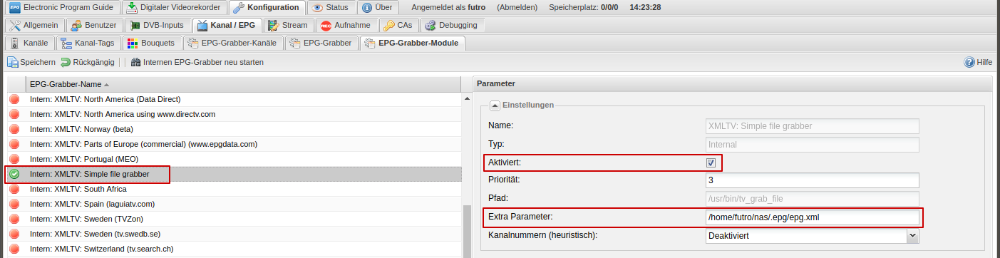

<h1>tv_grab_file - A simple file grabber that grabs your EPG XML Files directly into your TVHeadend server</h1>
<h2>Usage</h2>
Simply open a terminal and execute the code below. Set the permissions of the downloaded file to readable and executable: chmod a+rx. Restart TVHeadend.

    cd /usr/bin
    sudo su
    wget https://raw.githubusercontent.com/b-jesch/tv_grab_file/master/tv_grab_file
    chmod a+rx tv_grab_file
    exit

<b>Note: Some systems require root privileges to do that above! There are different ways, in this example we do that with: sudo su</b>

Open the TVHeadend Web Interface. Go to config, channel/EPG, EPG grabber modules. Enable the grabber module "internal:XMLTV:Simple file grabber" and set the "Extra Parameter" to the absolute path that points to your XML file.
In Case to specify a URL, you have to specify it complete with protocol, e.g. http://127.0.0.1/myepg.xml. Don't forget to save the changes.

Enjoy!
